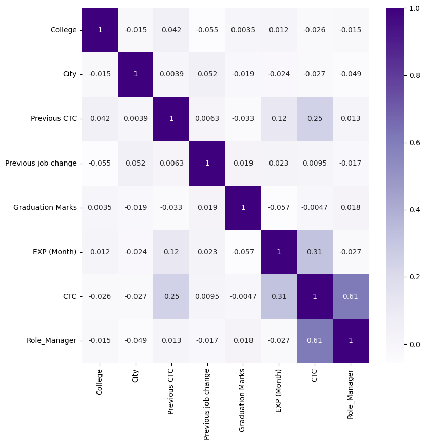
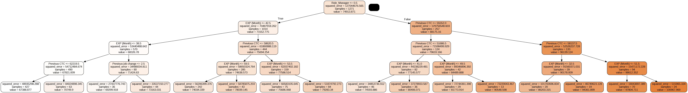
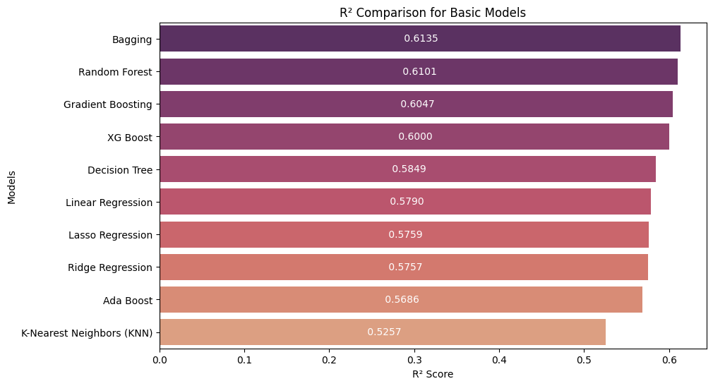
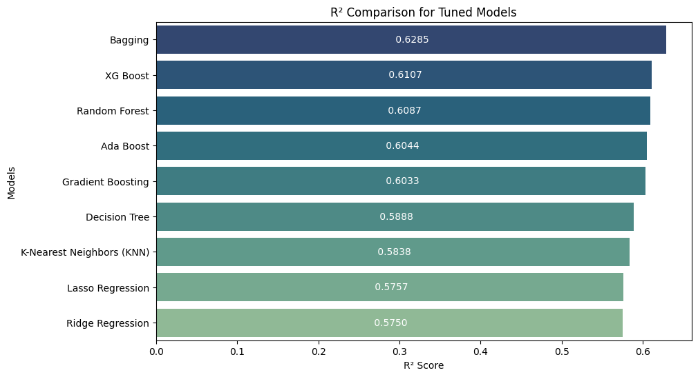
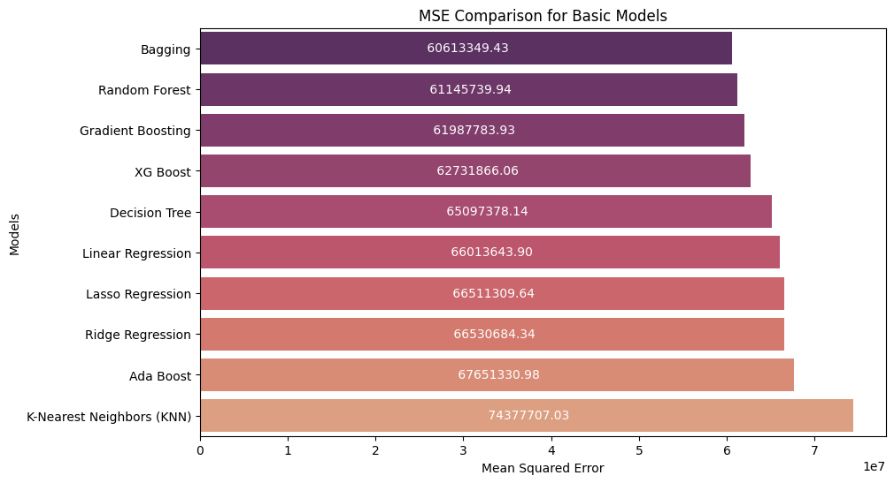
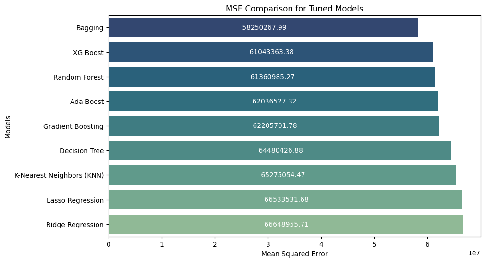
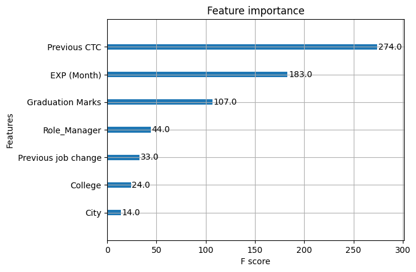

# Employee CTC Prediction

A regression project that predicts the CTC (salary) TechWorks Consulting should offer a new hire, based on the candidate's college tier, city, previous CTC, experience, graduation marks, and role. Eight regression models are trained and compared, then the best one is tuned with `GridSearchCV`.

## Problem

TechWorks Consulting hires IT professionals at scale and needs a consistent, data-driven way to set offers instead of relying on ad-hoc judgment. The goal is a model that predicts CTC accurately and tells the company which factors actually move the number.

## Dataset

1,589 employee records with 8 fields:

| Column | Description |
|---|---|
| College | Name of college attended |
| City | City the candidate is coming from |
| Role | Manager / Executive |
| Previous CTC | Salary at last job |
| Previous job change | Number of job changes so far |
| Graduation Marks | Academic score |
| EXP (Month) | Experience in months |
| CTC | Target variable — salary to predict |

Two lookup files are used to convert categorical fields into numeric ones:
- `Colleges.csv` — maps colleges to Tier 1 / Tier 2 / Tier 3
- `cities.csv` — maps cities to metro / non-metro

## Approach

1. **Cleaning** — mapped colleges to tier (1/2/3) and cities to metro (1) / non-metro (0), one-hot encoded `Role`, checked for nulls (none found).
2. **EDA** — boxplots to catch outliers, jointplots and a pairplot to check relationships, a correlation heatmap to see what actually drives CTC.

   

   `Role_Manager` and `CTC` show the strongest correlation (0.61), followed by `EXP (Month)` (0.31) and `Previous CTC` (0.25). Everything else is weak, which already hints at what the feature importance chart later confirms.

3. **Outlier treatment** — IQR capping on `Previous CTC` and `CTC`.
4. **Modeling** — trained Linear, Ridge, Lasso, KNN, Decision Tree, Bagging, Random Forest, Gradient Boosting, AdaBoost, and XGBoost. Each model tuned with `GridSearchCV` (Ridge/Lasso used `RidgeCV`/`LassoCV`).

   Example split learned by a Decision Tree, showing `Role_Manager`, `EXP (Month)`, and `Previous CTC` as the first few splits:

   

5. **Evaluation** — compared all models on R2 and MSE, before and after tuning.

## Results

**R² — basic models**



**R² — tuned models**



**MSE — basic models**



**MSE — tuned models**



| Model | R2 (tuned) | MSE (tuned) |
|---|---|---|
| **Bagging Regressor** | **0.6285** | **58250267** |
| XGBoost | 0.6107 | 61043363 |
| Random Forest | 0.6087 | 61360985 |
| AdaBoost | 0.6044 | 62036527 |
| Gradient Boosting | 0.6033 | 62205701 |
| Decision Tree | 0.5888 | 64480426 |
| KNN | 0.5838 | 65275054 |
| Lasso | 0.5757 | 66533531 |
| Ridge | 0.5750 | 66648955 |

**Bagging Regressor** performed best in both basic and tuned form. It averages predictions across many decision trees, which cuts variance and makes it more resistant to overfitting than a single tree or than boosting methods here, which didn't get the same depth of tuning due to compute limits.

According to XGBoost's feature importance, **Previous CTC** is the strongest predictor, followed by **experience** and **graduation marks**.



## What could improve this further

- Feature engineering — interaction terms between Previous CTC, experience, and graduation marks
- Deeper hyperparameter search on XGBoost/Gradient Boosting (compute-limited in this run)
- Stacking Bagging with XGBoost
- Repeated/stratified K-fold cross-validation for more stable evaluation

## Repo structure

```
employee-ctc-prediction/
├── notebook/
│   └── techworks_ctc_prediction.ipynb
├── data/
│   ├── ML_case_Study.csv
│   ├── Colleges.csv
│   └── cities.csv
├── images/
│   ├── 01_correlation_heatmap.png
│   ├── 02_decision_tree.png
│   ├── 03_feature_importance.png
│   ├── 04_r2_basic_models.png
│   ├── 05_r2_tuned_models.png
│   ├── 06_mse_basic_models.png
│   └── 07_mse_tuned_models.png
├── README.md
└── requirements.txt
```

## Running it

```bash
pip install -r requirements.txt
jupyter notebook notebook/techworks_ctc_prediction.ipynb
```

## Tech stack

Python, pandas, NumPy, scikit-learn, XGBoost, Seaborn, Matplotlib
